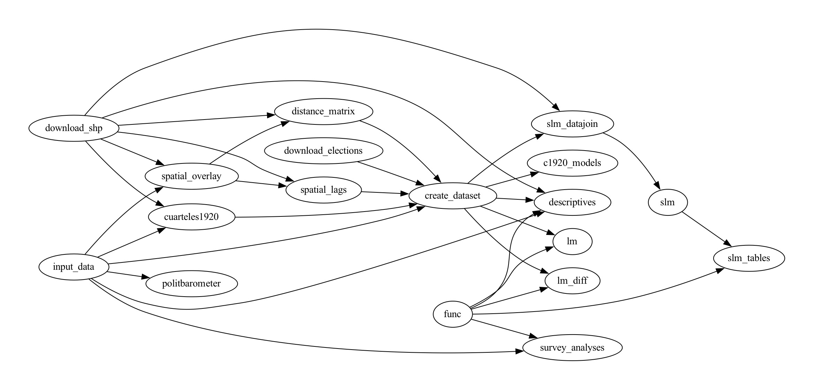

# README

### Replication files for "Rally 'round the barrack: Far-right support and the military", by Francisco Villamil, Stuart J. Turnbull-Dugarte, and José Rama.

This folder includes all the necessary materials to replicate the results from both the main Article and the Online Appendix. Most of them have been run using R 3.6 on macOS 12.3. We include the output from `sessionInfo()` at the end of this readme file. **NOTE:** The spatial analyses are computationally expensive and need a lot of RAM. We run it on a Google Cloud VM instance (e2-highmem-16, 128 GB RAM), and took around 72h. Without the spatial analyses, the code just takes a few minutes to build.

The code is organized in tasks that depend on the results of the previous ones. All the code is self-contained. Each folder contains the code and the output of one task. The taskflow is as follows:



In addition, there is an additional task (`cses`) that is self-contained.

---

#### Raw data files

There are two types of raw files that are needed to run the analyses. The `download_shp` contains shapefiles for Spanish provinces and census sections, while the `input_data` folder contains a set of files that were previously downloaded or created:

- `barometers_full.csv`: individual-level dataset that contains all surveys (monthly barometers) merged, which is used in the individual-level analyses. We define its variables in the separate codebook.
- `cuarteles.csv`: location of military facilities in Spain, coded as explained in the main paper
- `cuarteles1920.csv`: location of military facilities in Spain in 1920, coded from historical archives as explained in the main paper and in the Online Appendix
- `INE_census.csv`: census data for all Spanish municipalities, see [this repository](https://github.com/franvillamil/scrap-INE-census)
- `results1936.csv`: electoral results from 1936 elections, from replication data from Villamil (2021)
- `secc_censal_indic_demograficos.csv`: demographic data at the census section-level
- `secc_censal_renta.csv`: income data at the census section-level
- `ZA2391_v13-0-0.dta.zip`: Politbarometer data, obtained from the GESIS website ([https://search.gesis.org/research_data/ZA2391](https://search.gesis.org/research_data/ZA2391))

In addition, the `func` folder contains a set of R functions predefined that are used throghout the code.

#### Using `make`


---

#### R code

**Data creation:**

- `download_elections`
- `distance_matrix`
- `spatial_lags`
- `spatial_overlay`
- `create_dataset`
- `slm_datajoin`
- `cuarteles1920`

**Main analyses:**

- `lm`
- `lm_diff`
- `slm`
- `slm_tables`
- `survey_analyses`
- `cses`

**Extra:**

- `descriptives`
- `c1920_models`
- `politbarometer`


---

#### OS and software

**Note:** output from `sessionInfo()` (when running `02_modeling.R`):

```
R version 3.6.3 (2020-02-29)
Platform: x86_64-apple-darwin15.6.0 (64-bit)
Running under: macOS  10.16

Matrix products: default
BLAS:   /Library/Frameworks/R.framework/Versions/3.6/Resources/lib/libRblas.0.dylib
LAPACK: /Library/Frameworks/R.framework/Versions/3.6/Resources/lib/libRlapack.dylib

locale:
[1] en_US.UTF-8/en_US.UTF-8/en_US.UTF-8/C/en_US.UTF-8/en_US.UTF-8

attached base packages:
[1] stats     graphics  grDevices utils     datasets  methods   base

other attached packages:
 [1] xtable_1.8-4    stargazer_5.2.2 lmtest_0.9-38   zoo_1.8-8       estimatr_0.30.6
 [6] MatchIt_4.3.4   paletteer_1.4.0 patchwork_1.1.1 cobalt_4.3.2    forcats_0.5.1
[11] stringr_1.4.1   dplyr_1.0.10    purrr_0.3.4     readr_2.1.3     tidyr_1.2.1
[16] tibble_3.1.8    ggplot2_3.3.6   tidyverse_1.3.2

loaded via a namespace (and not attached):
 [1] tidyselect_1.2.0    rematch2_2.1.2      lattice_0.20-38     haven_2.5.1
 [5] gargle_1.2.0        colorspace_2.1-0    vctrs_0.5.2         generics_0.1.3
 [9] utf8_1.2.3          rlang_1.0.6         pillar_1.8.1        glue_1.6.2
[13] withr_2.5.0         DBI_1.1.1           dbplyr_2.1.1        modelr_0.1.8
[17] readxl_1.3.1        lifecycle_1.0.3     munsell_0.5.0       gtable_0.3.1
[21] cellranger_1.1.0    rvest_1.0.3         tzdb_0.3.0          fansi_1.0.4
[25] broom_1.0.1         Rcpp_1.0.10         scales_1.2.1        backports_1.4.1
[29] googlesheets4_1.0.0 jsonlite_1.8.4      fs_1.6.1            texreg_1.37.5
[33] hms_1.1.2           stringi_1.7.12      grid_3.6.3          cli_3.6.0
[37] tools_3.6.3         magrittr_2.0.3      Formula_1.2-4       crayon_1.5.2
[41] pkgconfig_2.0.3     ellipsis_0.3.2      xml2_1.3.3          reprex_2.0.1
[45] googledrive_2.0.0   lubridate_1.8.0     assertthat_0.2.1    httr_1.4.2
[49] R6_2.5.1            compiler_3.6.3
```
